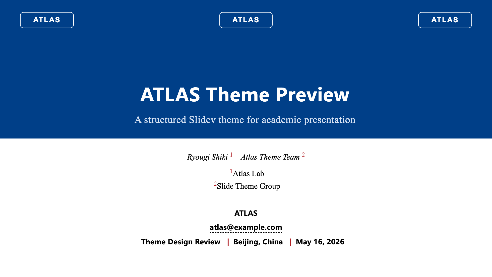
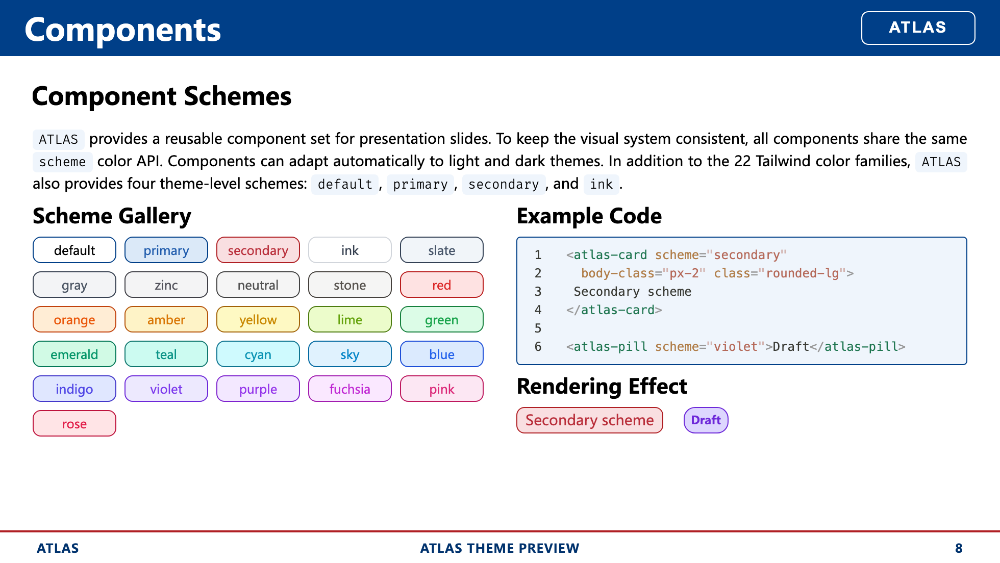
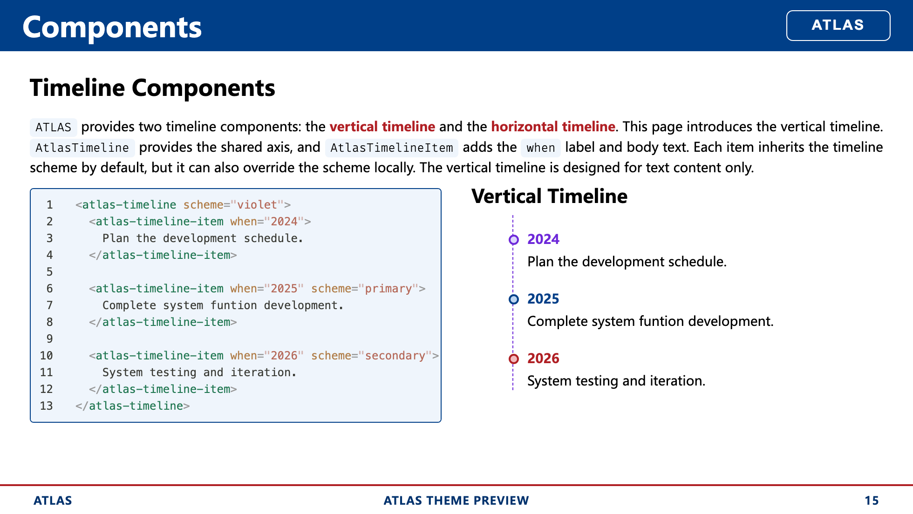
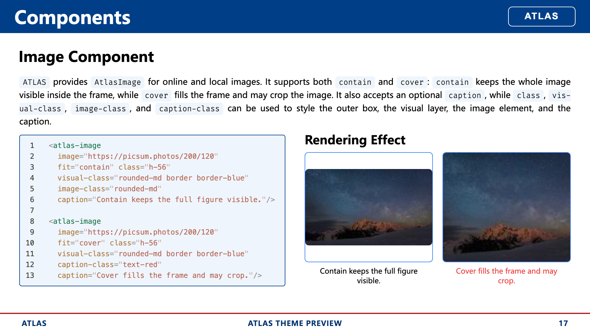
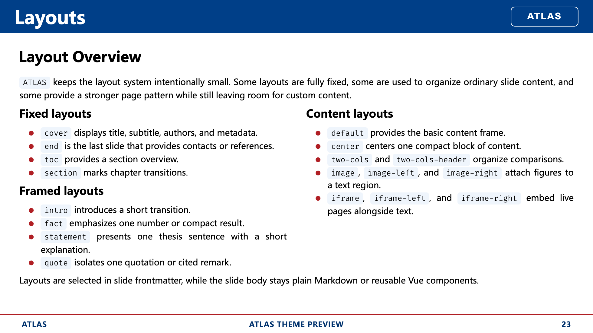
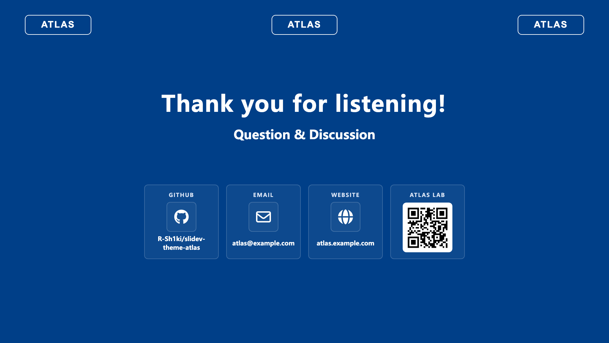

<h1 align="center">slidev-theme-atlas</h1>

<p align="center">
  A structured Slidev theme for academic and technical presentations.
</p>

<p align="center">
  
  
  
</p>

ATLAS is a structured [Slidev](https://sli.dev/) theme for academic and technical presentations. It preserves Slidev’s native Markdown workflow while providing a consistent visual frame, reusable layouts, scheme-based components, and a customizable brand color system for institutions, laboratories, and research groups.

## Preview

|                         Cover                         |                 Component Schemes                  |
| :---------------------------------------------------: | :------------------------------------------------: |
|        |  |
|                  Timeline Components                  |                  Media Components                  |
|  |     |
|                    Layout Overview                    |                     End Layout                     |
|     |         |

## Overview

ATLAS is designed around three priorities:

1. **Academic and technical presentation support**  
   The theme provides a paper-style cover, a structured header and footer, section pages, a contact-oriented end page, and layout patterns that work well for code, figures, comparisons, and research narrative.

2. **A rich component system with one shared color API**  
   Inline annotations, content blocks, metrics, comparison components, timelines, and media components all share the same `scheme` interface and adapt consistently across light and dark themes.

3. **Brand-level customization through `primary` and `secondary` palettes**  
   ATLAS exposes the full `--atlas-primary-*` and `--atlas-secondary-*` color families in [`styles/layout.css`](styles/layout.css), so the theme can be adapted to institutional visual systems without redesigning the component set.

## Theme-Specific Configuration

- [Cover metadata](#1-academic-and-technical-presentation-support)
- [End page links and contacts](#1-academic-and-technical-presentation-support)
- [Shared component schemes](#2-rich-components-with-a-unified-scheme-interface)
- [Primary and secondary palette customization](#3-customizable-primary-and-secondary-brand-colors)

## Theme Features

### 1. Academic and Technical Presentation Support

ATLAS includes several theme-specific conventions for academic decks:

- A **cover layout** with title, subtitle, presenter information, conference details, location, date, author list, and institution list.
- A **shared header and footer frame** for content layouts.
- Support for **logos on the cover, header, and end page**.
- An **end layout** that can render structured links, contact methods, and a QR code.
- Layouts for **code, figures, iframes, timelines, framed statements, and section transitions**.

Cover metadata is configured through headermatter:

```yaml
---
theme: atlas
title: ATLAS Theme Preview
subtitle: A structured Slidev theme for academic presentation
reporter: ATLAS
email: atlas@example.com
conference: Theme Design Review
location: Beijing, China
headerlogo: /assets/atlas-test-logo.svg
logos:
  - src: /assets/atlas-test-logo.svg
  - src: /assets/atlas-test-logo.svg
  - src: /assets/atlas-test-logo.svg
authors:
  - name: Ryougi Shiki
    inst_id: [1]
  - name: Atlas Theme Team
    inst_id: [2]
institutions:
  - id: 1
    name: Atlas Lab
  - id: 2
    name: Slide Theme Group
---
```

The principal theme-specific headermatter fields are listed below:

|     Field      | Purpose                                         |
| :------------: | ----------------------------------------------- |
|    `title`     | Presentation title used by the cover and footer |
|   `subtitle`   | Optional subtitle                               |
|   `reporter`   | Footer left slot and cover presenter line       |
|    `email`     | Cover email link                                |
|  `conference`  | Cover conference metadata                       |
|   `location`   | Cover conference metadata                       |
|    `logos`     | Logos shown on the cover and end page           |
|  `headerlogo`  | Logo shown in the shared header                 |
|   `authors`    | Optional author list for paper-style cover      |
| `institutions` | Optional institution list matched by `inst_id`  |
|  `showHeader`  | Per-slide override for the shared header        |
|  `showFooter`  | Per-slide override for the shared footer        |

The end layout supports structured contact and link items through `end_items`:

```yaml
---
layout: end
end_items:
  - [GitHub, github, R-Sh1ki/slidev-theme-atlas]
  - [Email, email, atlas@example.com]
  - [Website, website, atlas.example.com]
  - [ATLAS LAB, wechat, /assets/atlas-test-qrcode.png]
---
```

Supported icon keys include:

| Icon key   | Expected `value` format                             | Resolved behavior                              |
| ---------- | --------------------------------------------------- | ---------------------------------------------- |
| `github`   | `owner/repo` or `github.com/owner/repo`             | Converts to a GitHub repository link           |
| `email`    | `name@example.com`                                  | Converts to a `mailto:` link                   |
| `website`  | `example.com` or full URL                           | Converts to an external website link           |
| `homepage` | `example.com` or full URL                           | Converts to an external website link           |
| `link`     | `example.com` or full URL                           | Converts to a generic external link            |
| `repo`     | `example.com` or full URL                           | Converts to a repository-style external link   |
| `discord`  | invite code, `discord.gg/...`, or `discord.com/...` | Converts to a Discord invite link              |
| `wechat`   | QR image path                                       | Renders a QR code block instead of a text link |
| `zenodo`   | record id, `records/...`, or `zenodo.org/...`       | Converts to a Zenodo record link               |
| `contact`  | free text or URL                                    | Uses a generic contact icon; link is optional  |

For most cases, the compact tuple form is sufficient:

```yaml
- [Label, icon, value]
```

### 2. Rich Components with a Unified Scheme Interface

ATLAS provides a reusable component set for technical slides:

- **Inline components**: `AtlasEyebrow`, `AtlasPill`, `AtlasDot`, `AtlasKbd`, `AtlasStep`
- **Content components**: `AtlasCard`, `AtlasBlock`, `AtlasCallout`, `AtlasTool`
- **Data and comparison components**: `AtlasStat`, `AtlasMetric`, `AtlasPros`, `AtlasCons`, `AtlasCompare`
- **Timeline components**: `AtlasTimeline`, `AtlasTimelineItem`, `AtlasTimelineH`, `AtlasTimelineHItem`
- **Media components**: `AtlasImage`, `AtlasVideo`, `AtlasIframe`, `AtlasBackground`

All visual components share the same `scheme` API. This keeps color treatment consistent across component categories and allows light and dark themes to adapt automatically without changing component usage.

```html
<AtlasCard scheme="secondary" body-class="px-4 py-3">
  This card uses the shared secondary scheme.
</AtlasCard>

<AtlasPill scheme="violet">Draft</AtlasPill>

<AtlasMetric
  scheme="primary"
  value="24"
  label="Components"
  delta="+4"
  trend="up"
/>
```

ATLAS supports:

- the four theme-level schemes: `default`, `primary`, `secondary`, `ink`
- the Tailwind color families from `slate` through `rose`

Because the scheme system is shared, a single palette choice can be applied consistently across cards, callouts, metrics, tags, timelines, and media containers.

### 3. Customizable `primary` and `secondary` Brand Colors

ATLAS is designed to be adapted. The theme exposes full `primary` and `secondary` color families in [`styles/layout.css`](styles/layout.css), and the rest of the visual system derives from them.

An institution can therefore update the palette once and retain the rest of the theme structure unchanged.

The relevant tokens are:

```css
--atlas-primary-50
--atlas-primary-100
--atlas-primary-200
--atlas-primary-300
--atlas-primary-400
--atlas-primary-500
--atlas-primary-600
--atlas-primary-700
--atlas-primary-800
--atlas-primary-900
--atlas-primary-950

--atlas-secondary-50
--atlas-secondary-100
--atlas-secondary-200
--atlas-secondary-300
--atlas-secondary-400
--atlas-secondary-500
--atlas-secondary-600
--atlas-secondary-700
--atlas-secondary-800
--atlas-secondary-900
--atlas-secondary-950
```

The typical customization flow is:

1. Replace the `--atlas-primary-*` family with the institution’s main color scale.
2. Replace the `--atlas-secondary-*` family with the accent or contrast color scale.
3. Keep the rest of the theme logic unchanged so headers, footers, layouts, and components continue to adapt automatically.

For example:

```css
:root {
  --atlas-primary-50: #f4f7fb;
  --atlas-primary-100: #dfe8f5;
  --atlas-primary-200: #c0d3ee;
  --atlas-primary-300: #94b6e3;
  --atlas-primary-400: #5f8fd2;
  --atlas-primary-500: #336bbf;
  --atlas-primary-600: #1f54a5;
  --atlas-primary-700: #0b3d7a;
  --atlas-primary-800: #082f5d;
  --atlas-primary-900: #051f3e;
  --atlas-primary-950: #031226;

  --atlas-secondary-50: #fdf3f2;
  --atlas-secondary-100: #f9e1df;
  --atlas-secondary-200: #f1c0ba;
  --atlas-secondary-300: #e58f85;
  --atlas-secondary-400: #d86254;
  --atlas-secondary-500: #c84534;
  --atlas-secondary-600: #b53324;
  --atlas-secondary-700: #952416;
  --atlas-secondary-800: #73180e;
  --atlas-secondary-900: #4f0e08;
  --atlas-secondary-950: #320804;
}
```

## Detailed Usage

### Install the theme

After the package is published, install it in another Slidev deck:

```bash
npm add -D slidev-theme-atlas
```

Then enable it in slide frontmatter:

```yaml
---
theme: atlas
---
```

For local development before publishing, a relative path also works:

```yaml
---
theme: ../slidev-theme-atlas
---
```

### Minimal Deck Example

```yaml
---
theme: atlas
layout: cover
colorSchema: light
title: Structured Presentation Design
subtitle: A concise example deck built with ATLAS
reporter: Example Author
email: example@lab.edu
conference: Internal Research Review
location: Shanghai, China
headerlogo: /assets/atlas-test-logo.svg
logos:
  - src: /assets/atlas-test-logo.svg
authors:
  - name: Example Author
    inst_id: [1]
institutions:
  - id: 1
    name: Example Lab
---
```

### Section and Content Example

```yaml
---
layout: section
section: Components
---
This section introduces the reusable ATLAS component set.
---
layout: two-cols-header
---
# Component Schemes

ATLAS keeps component colors consistent with one shared `scheme` API.

::left::

<AtlasCard scheme="secondary" body-class="px-4 py-3">
  Secondary scheme
</AtlasCard>

::right::

<AtlasCard scheme="secondary" body-class="px-4 py-3">
  Secondary scheme
</AtlasCard>
```

### End Page Example

```yaml
---
layout: end
end_items:
  - [GitHub, github, your-org/your-repo]
  - [Email, email, contact@example.edu]
  - [Website, website, example.edu]
---
```

## Layouts

| Category        | Layouts                                                                                                                           | Notes                                                                       |
| --------------- | --------------------------------------------------------------------------------------------------------------------------------- | --------------------------------------------------------------------------- |
| Fixed layouts   | `cover`, `end`, `toc`, `section`                                                                                                  | Used for title pages, closing pages, navigation, and section transitions    |
| Content layouts | `default`, `center`, `two-cols`, `two-cols-header`, `image`, `image-left`, `image-right`, `iframe`, `iframe-left`, `iframe-right` | Used for the main body of technical and content-driven slides               |
| Framed layouts  | `intro`, `fact`, `statement`, `quote`                                                                                             | Used for guided transitions, emphasized facts, short claims, and quotations |

## Development

Install dependencies:

```bash
npm install
```

Run the preview deck locally:

```bash
npm run dev
```

Build the preview deck:

```bash
npm run build
```

Export static screenshots:

```bash
npm run screenshot -- --output docs/screenshots
```

## Repository Structure

- [`components/`](components): reusable Vue components exposed by the theme
- [`layouts/`](layouts): Slidev layouts
- [`styles/`](styles): shared theme styles and color system
- [`assets/`](assets): local media and example assets
- [`example.md`](example.md): full theme preview deck
- [`docs/previews`](docs/previews): curated preview images used by the README
